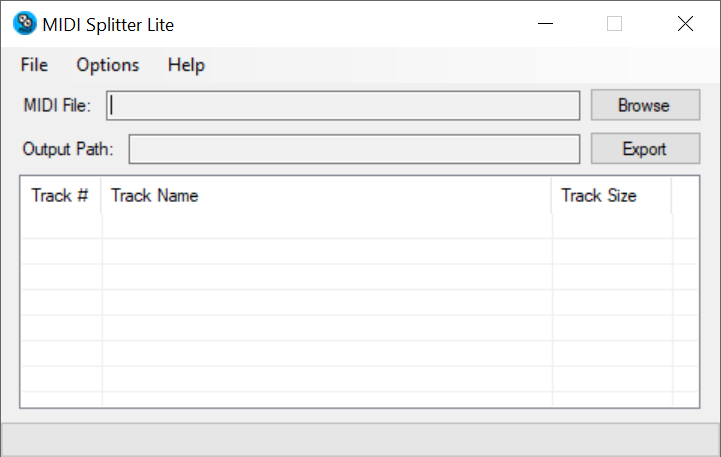

# MIDI Splitter Lite

Overview
------------

MIDI Splitter Lite is a simple, lightweight program that splits tracks from a single MIDI file into their own seperate MIDI files.

Usage
------------

1. Click the "Browse" button next to the box labeled "MIDI File:" to open a MIDI file for splitting, or simply drag and drop a single MIDI file to open it for splitting as well.

2. Click the "Export" button next to the box labeled "Output Path:" and select the desired folder the MIDI tracks will be extracted to.

3. Options:
	- First Track Duplication: Opt to duplicate the initial track from the MIDI file onto all selected tracks for export. This feature is especially handy when the first track contains crucial setup information like tempo, which you might want to replicate across other tracks.

	- Track Name Reading: Enable the functionality to read and display names for every track within the MIDI file. This setting is designed to be efficient and should not significantly impact the file's loading time.
		- Note: Should you alter the 'Read track names' setting, it's recommended to reload the MIDI file to ensure the changes are effectively applied.  

	- File Name Prefixing: Choose to prepend the original MIDI file's name to each track. This option is useful for maintaining a reference to the original file when working with multiple tracks.

	- Color-Coded Track Naming: Personalize your tracks by assigning specific colors (Red, Orange, Yellow, Green, Light Blue, Blue, Purple) to them. Simply input the desired names for your tracks under the color you want them to be.

	- Edit Track Names: Before splitting the tracks into individual tracks right click them to edit their names.

4. Once the list is populated with tracks, select the track(s) you wish to be exported. To select multiple tracks, simply hold the CTRL key on your keyboard and left-click each track name in the list. You can also select all tracks in the list by pressing CTRL + A on your keyboard.

5. When finished selecting the desired track(s) to be exported, select the "Split track(s)" item under the File Menu to begin splitting the track(s) into their own seperate MIDI file.

Limitations
------------

- Only MIDIs created under the MIDI 1.0 specification are supported
- Only Format 1 MIDI files are supported

References
------------

To learn more about the MIDI 1.0 specification, visit the links below:
- MIDI File Format Specifications: https://github.com/colxi/midi-parser-js/wiki/MIDI-File-Format-Specifications
- The MIDI File Format: http://www.personal.kent.edu/~sbirch/Music_Production/MP-II/MIDI/midi_file_format.htm

MIDI Splitter Lite utilizes the Knuth–Morris–Pratt search algorithm to read the names of the tracks in a MIDI file. More information about the KMP search algorithm is available in the links below:
- C# implementation of KMP algorithm: https://gist.github.com/Nabid/fde41e7c2b0b681ac674ccc93c1daeb1
- Searching for Patterns | Set 2 (KMP Algorithm): https://www.geeksforgeeks.org/searching-for-patterns-set-2-kmp-algorithm/

